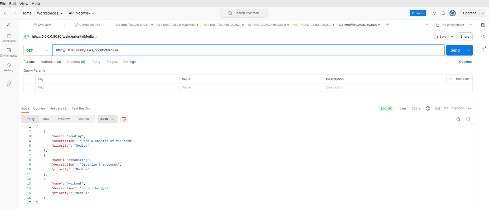
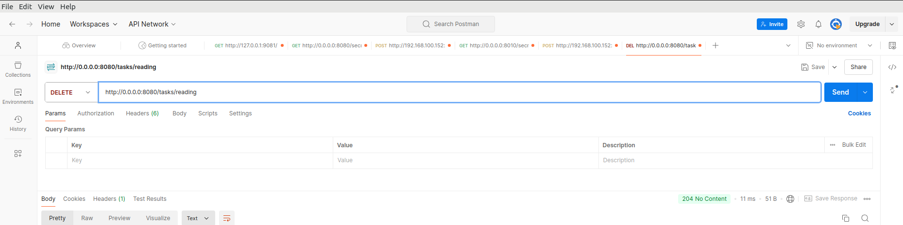
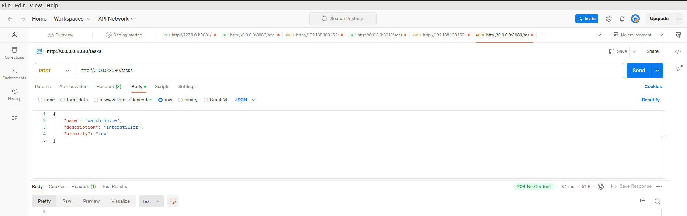

# Ktor CRUD REST API

This project is a REST API built using Kotlin and Ktor that allows users to perform basic CRUD (Create, Read, Update, Delete) operations on tasks. The API enables you to add, remove, and view tasks easily. The project is designed with simplicity and efficiency in mind, using Kotlin's concise syntax and Ktor's powerful features.

## Features

- **Add Task:** Create a new task with a title, description, and priority.
- **Read Tasks:** View the list of all tasks.
- **Update Task:** Modify an existing task's details.
- **Delete Task:** Remove a task from the list.

## Getting Started

### Prerequisites

- [Kotlin](https://kotlinlang.org/) installed
- [IntelliJ IDEA](https://www.jetbrains.com/idea/) or [Android Studio](https://developer.android.com/studio)

### Installation

1. **Clone the Repository**
2. **Open the Project**

- Open the cloned project in IntelliJ IDEA or Android Studio.

3. **Run the Application**

- Run the project using the main class configured in your IDE.


## Screenshot




## API Endpoints

### 1. Get All Tasks

- **URL:** `/tasks`
- **Method:** `GET`
- **Description:** Retrieves a list of all tasks.

### 2. Add a Task

- **URL:** `/tasks`
- **Method:** `POST`
- **Body:**

  ```json
  {
    "title": "Task Title",
    "description": "Task Description",
    "priority": "Low | Medium | High"
  }
### 3. Delete a Task

- **URL:** `/tasks/{id}`
- **Method:** `DELETE`
- **Description:** Deletes a task by ID.

## Testing the API

You can test the API using tools like Postman or local browser. Each endpoint allows for testing CRUD operations with appropriate request types and payloads.

## Step-by-Step Guidance

For detailed step-by-step guidance on how to create a REST API using Ktor, you can check out my [Medium article](https://medium.com/@tariqjamel/creating-your-first-rest-api-with-ktor-a-step-by-step-tutorial-b4f6127e4d69). This article will guide you through the process, from setting up your environment to implementing CRUD operations.

## Contributing

Contributions are welcome! If you have any suggestions, bug fixes, or feature implementations, please submit a pull request.

